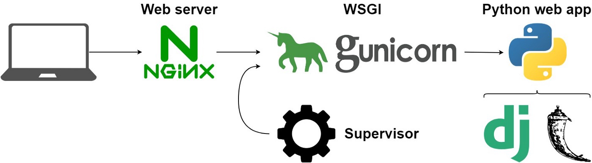

## Deploying to Production

[**Docker**](https://www.docker.com/) image with [**Gunicorn**](https://flask.palletsprojects.com/en/2.2.x/deploying/gunicorn/) for [**Flask**](https://flask.palletsprojects.com/en/2.2.x/) applications in Python3.11. Optionally with Alpine Linux.

## Run the application
`docker compose up`